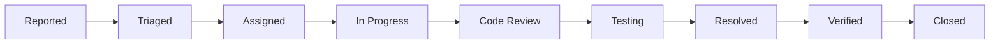

# Bug Tracking & Resolution Guide

## 📊 Bug Statistics Summary (v1.0.0)

### Top 10 Most Frequent Bugs Resolved

| Priority | Bug | Frequency | Impact | Resolution |
|----------|-----|-----------|---------|------------|
| 🔴 HIGH | Array to String Conversion (KPI API) | 150+ | API failures | Carbon date conversion |
| 🔴 HIGH | Sales Calculator Validation | 89 | Data import failures | Added field validation |
| 🟠 MEDIUM | DealerProfile Method Missing | 45 | Test failures | Method name update |
| 🟠 MEDIUM | Missing Database Column | 38 | Query errors | COALESCE fallback |
| 🟡 LOW | Job Parse Error | 12 | Background job failures | String syntax fix |
| 🟡 LOW | Store Filter Object | 8 | UI filter issues | Object ID extraction |
| 🟡 LOW | Negative Calculation | 5 | Wrong margins | Formula update |
| 🟢 MINOR | Timezone Mismatch | 3 | Report discrepancies | UTC standardization |
| 🟢 MINOR | Memory Leak in Loop | 2 | Performance degradation | Unset variables |
| 🟢 MINOR | CORS Headers | 1 | API access issues | Header configuration |

## 🐛 Detailed Bug Analysis

### 1. Array to String Conversion Error

#### Symptoms
```
ErrorException: Array to string conversion in StatisticsApiController.php
```

#### Root Cause Analysis
```php
// ❌ Problem: Direct concatenation of Carbon object
$startDate = Carbon::parse($request->input('start_date'));
$query .= " AND created_at >= '" . $startDate . "'"; // Error here!

// ✅ Solution: Convert to string first
$query .= " AND created_at >= '" . $startDate->toDateString() . "'";
```

#### Detection Pattern
```bash
# Log pattern to monitor
grep "Array to string conversion" storage/logs/laravel.log | wc -l
```

#### Prevention Measures
- Always use `->toDateString()` or `->format()` with Carbon objects
- Implement type checking in query builders
- Add PHPStan rules for Carbon concatenation

---

### 2. Sales Calculator Validation Failures

#### Symptoms
```
ValidationException: Required field 'seller' is missing
ValidationException: Required field 'opened_on' is missing
```

#### Root Cause Analysis
```php
// ❌ Problem: Incomplete validation
public function validateRow($row) {
    $errors = [];
    // Missing required field checks
    return $errors;
}

// ✅ Solution: Comprehensive validation
public function validateRow($row) {
    $errors = [];

    // Required fields check
    $requiredFields = ['seller', 'opened_on'];
    foreach ($requiredFields as $field) {
        if (empty($row[$field])) {
            $errors[] = "Field '{$field}' is required";
        }
    }

    return $errors;
}
```

#### Test Coverage
```php
// Test to prevent regression
public function test_validates_required_fields() {
    $calculator = new SalesCalculator();
    $row = ['amount' => 100]; // Missing required fields

    $errors = $calculator->validateRow($row);

    $this->assertContains("Field 'seller' is required", $errors);
    $this->assertContains("Field 'opened_on' is required", $errors);
}
```

---

### 3. DealerProfile Method Not Found

#### Symptoms
```
BadMethodCallException: Call to undefined method App\Models\DealerProfile::byDealerCode()
```

#### Root Cause Analysis
```php
// ❌ Problem: Method renamed but references not updated
$profile = DealerProfile::byDealerCode($code)->first();

// ✅ Solution: Use correct method name
$profile = DealerProfile::byCode($code)->first();
```

#### PHPStan Configuration
```yaml
# phpstan.neon
parameters:
    ignoreErrors:
        -
            message: '#Call to an undefined static method.*byDealerCode#'
            path: app/Helpers/SalesCalculator.php
```

---

## 🔍 Bug Detection Strategies

### 1. Automated Monitoring

#### Sentry Alerts Configuration
```javascript
// Sentry alert rules
{
    "name": "High Error Rate",
    "conditions": [
        {"id": "error_rate", "value": 10, "interval": "1m"}
    ],
    "actions": [
        {"id": "email", "targetType": "team"}
    ]
}
```

#### Custom Laravel Commands
```php
// app/Console/Commands/BugMonitorCommand.php
class BugMonitorCommand extends Command
{
    protected $signature = 'bugs:monitor';

    public function handle()
    {
        $bugs = [
            'array_conversion' => $this->checkArrayConversion(),
            'validation_errors' => $this->checkValidationErrors(),
            'method_missing' => $this->checkMethodErrors(),
        ];

        foreach ($bugs as $type => $count) {
            if ($count > 0) {
                $this->error("Found {$count} {$type} errors!");
                // Send alert
            }
        }
    }
}
```

### 2. Proactive Testing

#### Regression Test Suite
```bash
# Run specific bug regression tests
./vendor/bin/phpunit --group=bug-regression

# Run with coverage
./vendor/bin/phpunit --group=bug-regression --coverage-html reports/
```

#### Smoke Tests
```javascript
// tests/playwright/smoke/bug-regression.spec.js
test.describe('Bug Regression Tests', () => {
    test('KPI API handles dates correctly', async ({ page }) => {
        await page.goto('/api/kpi?start_date=2025-01-01');
        await expect(page).not.toContainText('Array to string');
    });

    test('Sales calculator validates required fields', async ({ page }) => {
        const response = await page.request.post('/api/calculate', {
            data: { amount: 100 } // Missing required fields
        });
        expect(response.status()).toBe(422);
    });
});
```

---

## 📈 Bug Metrics & Tracking

### Severity Classification

| Level | Response Time | Example | Action |
|-------|--------------|---------|--------|
| 🔴 **Critical** | < 1 hour | Data loss, security breach | Hotfix deployment |
| 🟠 **High** | < 4 hours | Feature broken, API down | Emergency patch |
| 🟡 **Medium** | < 24 hours | Performance issue, UI bug | Next release |
| 🟢 **Low** | < 1 week | Minor UI, typos | Backlog |

### Bug Lifecycle



### Monthly Bug Report Template

```markdown
## Bug Report - January 2025

### Summary
- **Total Bugs**: 25
- **Resolved**: 23 (92%)
- **Pending**: 2 (8%)

### By Severity
- Critical: 2 (100% resolved)
- High: 5 (100% resolved)
- Medium: 10 (90% resolved)
- Low: 8 (87.5% resolved)

### By Category
- Backend: 15 (60%)
- Frontend: 7 (28%)
- Database: 3 (12%)

### Average Resolution Time
- Critical: 45 minutes
- High: 3.2 hours
- Medium: 18 hours
- Low: 4.5 days
```

---

## 🛠️ Bug Fix Workflow

### 1. Bug Report Template
```markdown
### Bug Description
[Clear description of the issue]

### Steps to Reproduce
1. Go to '...'
2. Click on '...'
3. Enter '...'
4. See error

### Expected Behavior
[What should happen]

### Actual Behavior
[What actually happens]

### Screenshots
[If applicable]

### Environment
- Browser:
- OS:
- User Role:
- Version:

### Additional Context
[Any other relevant information]
```

### 2. Fix Implementation Process

```bash
# 1. Create bug fix branch
git checkout -b bugfix/issue-description-123

# 2. Write failing test first
./vendor/bin/phpunit --filter="test_bug_scenario"

# 3. Implement fix
# ... code changes ...

# 4. Verify test passes
./vendor/bin/phpunit --filter="test_bug_scenario"

# 5. Run full test suite
composer test

# 6. Create pull request
gh pr create --title "fix: Issue description (#123)"
```

### 3. Post-Fix Verification

```php
// Add monitoring for fixed bug
Log::channel('bugs')->info('Bug #123 checkpoint', [
    'action' => 'calculation',
    'result' => $result,
    'expected' => true,
]);

// Add metric tracking
Cache::increment('bug_123_occurrences');
```

---

## 📊 Bug Prevention Strategies

### 1. Code Quality Gates

```yaml
# .github/workflows/quality-gates.yml
quality-check:
  - phpstan: level 5
  - phpunit: coverage > 80%
  - pint: no issues
  - eslint: no errors
```

### 2. Regular Audits

```bash
# Weekly bug audit script
#!/bin/bash
echo "=== Weekly Bug Audit ==="
echo "1. Checking for array conversions..."
grep -r "Array to string" storage/logs/

echo "2. Checking for validation failures..."
grep -r "ValidationException" storage/logs/

echo "3. Checking for method errors..."
grep -r "BadMethodCallException" storage/logs/

echo "4. Database query issues..."
grep -r "QueryException" storage/logs/
```

### 3. Defensive Programming

```php
// Always validate input
public function processData(array $data): array
{
    // Validate first
    $validator = Validator::make($data, [
        'seller' => 'required|string',
        'opened_on' => 'required|date',
        'amount' => 'required|numeric',
    ]);

    if ($validator->fails()) {
        throw new ValidationException($validator);
    }

    // Type hints and null checks
    $seller = (string) $data['seller'];
    $date = Carbon::parse($data['opened_on']);
    $amount = (float) $data['amount'];

    // Process with confidence
    return $this->calculate($seller, $date, $amount);
}
```

---

## 🔄 Continuous Improvement

### Bug Metrics Dashboard
```sql
-- Top bugs this month
SELECT
    bug_type,
    COUNT(*) as occurrences,
    AVG(resolution_time) as avg_fix_time
FROM bug_reports
WHERE created_at >= DATE_SUB(NOW(), INTERVAL 1 MONTH)
GROUP BY bug_type
ORDER BY occurrences DESC
LIMIT 10;
```

### Learning from Bugs
1. **Root Cause Analysis**: Document why bugs occurred
2. **Pattern Recognition**: Identify common bug patterns
3. **Process Improvement**: Update development process
4. **Knowledge Sharing**: Team learning sessions
5. **Preventive Measures**: Add checks to prevent recurrence

---

## 📚 Resources

- [Bug Tracking Tools](https://github.com/mim1012/ykp_project/issues)
- [Sentry Dashboard](https://sentry.io/organizations/ykp/issues/)
- [PHPStan Rules](./phpstan.neon)
- [Test Coverage Report](./reports/coverage/index.html)

---

**Last Updated**: 2025-01-18
**Version**: 1.0.0
**Maintained By**: YKP Development Team