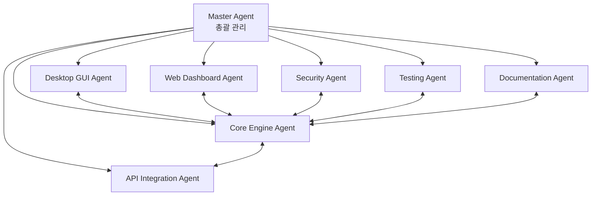
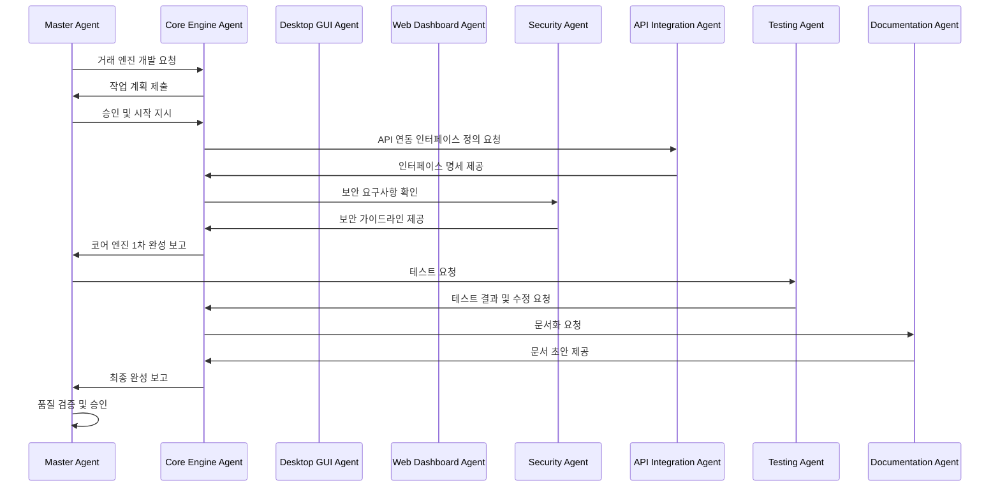

# Claude 서브 에이전트 할당 가이드
## Sub-Agent Assignment & Task Distribution Guide

---

## 📋 문서 정보

| 항목 | 내용 |
|------|------|
| **문서명** | Claude 서브 에이전트 할당 가이드 |
| **버전** | v1.0 |
| **작성일** | 2025년 8월 31일 |
| **대상** | Claude AI 시스템, 개발 관리자 |
| **목적** | 역할별 전문화된 에이전트 분담 |

---

## 🎯 1. 서브 에이전트 개요

### 1.1 전문화 전략
**각 Claude 서브 에이전트는 특정 도메인에 특화되어 최고의 성능을 발휘**

```
Master Agent (총괄)
├── Core Engine Agent (코어 엔진 전문)
├── Desktop GUI Agent (데스크톱 GUI 전문)  
├── Web Dashboard Agent (웹 대시보드 전문)
├── Security Agent (보안 전문)
├── API Integration Agent (API 통합 전문)
├── Testing Agent (테스트 전문)
└── Documentation Agent (문서화 전문)
```

### 1.2 협업 구조


---

## 🤖 2. 서브 에이전트 상세 정의

### 2.1 Master Agent (총괄 관리자)

**🎯 역할:**
- 전체 프로젝트 총괄 관리
- 서브 에이전트 간 작업 조율
- 최종 의사결정 및 품질 검증
- 클라이언트와의 주요 소통

**📋 주요 책임:**
- 프로젝트 로드맵 관리
- 서브 에이전트 작업 할당
- 품질 게이트 관리
- 최종 코드 리뷰 및 승인
- 릴리즈 관리

**🔧 사용 도구:**
- GitHub Project Management
- 전체 코드베이스 접근
- 모든 서브 에이전트와 통신

**📊 성과 지표:**
- 프로젝트 일정 준수율
- 전체 코드 품질 점수
- 서브 에이전트 협업 효율성

---

### 2.2 Core Engine Agent (코어 엔진 전문가)

**🎯 전문 분야:**
- 거래 엔진 로직 (5가지 진입 조건)
- 청산 시스템 (4가지 청산 방식)
- 리스크 관리 시스템
- 데이터 처리 및 분석

**📋 담당 모듈:**
```python
core/
├── trading_engine.py      # 🎯 주요 담당
├── risk_manager.py        # 🎯 주요 담당
├── data_processor.py      # 🎯 주요 담당
├── time_controller.py     # 🎯 주요 담당
└── logger.py             # 🔧 지원 담당
```

**🧠 전문 지식:**
- 금융 거래 로직 및 알고리즘
- 실시간 데이터 처리
- 통계 분석 및 패턴 인식
- 성능 최적화 기법

**📝 작업 예시:**
```python
class TradingEngine:
    """거래 엔진 - Core Engine Agent 담당"""
    
    def __init__(self):
        self.entry_conditions = [
            MovingAverageCondition(),
            PriceChannelCondition(),
            OrderBookCondition(),
            TickBasedCondition(),
            CandleStateCondition()
        ]
        self.exit_conditions = [
            PCSExitCondition(),
            TrailingStopCondition(),
            OrderBookExitCondition(),
            BreakevenCondition()
        ]
    
    def evaluate_entry_signals(self, market_data: MarketData) -> List[Signal]:
        """진입 신호 평가 - 복잡한 로직 구현"""
        signals = []
        for condition in self.entry_conditions:
            if condition.is_active():
                signal = condition.evaluate(market_data)
                if signal.is_valid():
                    signals.append(signal)
        return signals
```

**🎯 품질 기준:**
- 거래 로직 정확성: 100%
- 실시간 처리 지연: <10ms
- 메모리 사용량: <100MB
- CPU 사용률: <5%

---

### 2.3 Desktop GUI Agent (데스크톱 GUI 전문가)

**🎯 전문 분야:**
- PyQt5/PyQt6 GUI 개발
- 사용자 경험 (UX) 설계
- 실시간 차트 및 위젯
- 데스크톱 애플리케이션 최적화

**📋 담당 모듈:**
```python
desktop/
├── main_gui.py           # 🎯 주요 담당
├── tabs/                 # 🎯 주요 담당
│   ├── entry_tab.py
│   ├── exit_tab.py
│   └── settings_tab.py
├── widgets/              # 🎯 주요 담당
│   ├── chart_widget.py
│   ├── position_widget.py
│   └── status_widget.py
└── utils/                # 🔧 지원 담당
    ├── gui_utils.py
    └── theme_manager.py
```

**🧠 전문 지식:**
- PyQt5/6 고급 기능
- 반응형 GUI 설계
- 실시간 데이터 시각화
- 사용자 인터페이스 디자인 패턴

**📝 작업 예시:**
```python
class EntrySettingsTab(QWidget):
    """진입 설정 탭 - Desktop GUI Agent 담당"""
    
    def __init__(self, parent=None):
        super().__init__(parent)
        self.setup_ui()
        self.connect_signals()
    
    def setup_ui(self):
        """UI 레이아웃 구성"""
        layout = QVBoxLayout()
        
        # 이동평균선 조건 그룹
        ma_group = self.create_ma_condition_group()
        layout.addWidget(ma_group)
        
        # Price Channel 조건 그룹
        pc_group = self.create_pc_condition_group()
        layout.addWidget(pc_group)
        
        # 실시간 상태 표시
        status_widget = self.create_status_widget()
        layout.addWidget(status_widget)
        
        self.setLayout(layout)
    
    def create_ma_condition_group(self) -> QGroupBox:
        """이동평균선 조건 UI 생성"""
        group = QGroupBox("📐 이동평균선 조건")
        layout = QFormLayout()
        
        # 드롭다운 박스로 깔끔한 선택
        self.ma_open_combo = QComboBox()
        self.ma_open_combo.addItems([
            "선택 안함",
            "시가 > 이평선 → 매수 진입",
            "시가 < 이평선 → 매도 진입",
            "시가 < 이평선 → 매수 진입",
            "시가 > 이평선 → 매도 진입"
        ])
        
        layout.addRow("시가 비교:", self.ma_open_combo)
        group.setLayout(layout)
        return group
```

**🎯 품질 기준:**
- UI 반응성: <50ms
- 메모리 사용량: <200MB
- 사용자 만족도: 4.5/5.0
- 크로스 플랫폼 호환성: 100%

---

### 2.4 Web Dashboard Agent (웹 대시보드 전문가)

**🎯 전문 분야:**
- Flask/FastAPI 웹 개발
- 반응형 웹 디자인
- WebSocket 실시간 통신
- 모바일 최적화

**📋 담당 모듈:**
```python
web/
├── app.py               # 🎯 주요 담당
├── routes/              # 🎯 주요 담당
│   ├── api.py
│   ├── websocket.py
│   └── auth.py
├── templates/           # 🎯 주요 담당
│   ├── dashboard.html
│   ├── settings.html
│   └── login.html
├── static/              # 🎯 주요 담당
│   ├── css/
│   ├── js/
│   └── img/
└── utils/               # 🔧 지원 담당
```

**🧠 전문 지식:**
- 현대적 웹 프레임워크
- RESTful API 설계
- WebSocket 프로토콜
- 반응형 디자인 (Bootstrap, CSS Grid)
- JavaScript ES6+ 및 비동기 프로그래밍

**📝 작업 예시:**
```python
# Flask 백엔드 - Web Dashboard Agent 담당
@app.route('/api/trading/status', methods=['GET'])
@jwt_required()
def get_trading_status():
    """거래 상태 API"""
    try:
        status = trading_engine.get_status()
        positions = position_manager.get_all_positions()
        
        return jsonify({
            'status': 'success',
            'data': {
                'is_active': status.is_active,
                'positions': [p.to_dict() for p in positions],
                'last_update': status.last_update.isoformat()
            }
        })
    except Exception as e:
        return jsonify({'status': 'error', 'message': str(e)}), 500

# WebSocket 실시간 통신
@socketio.on('subscribe_positions')
def handle_position_subscription():
    """포지션 구독"""
    join_room('positions')
    emit('subscription_confirmed', {'channel': 'positions'})

def broadcast_position_update(position_data):
    """포지션 업데이트 브로드캐스트"""
    socketio.emit('position_update', position_data, room='positions')
```

```html
<!-- 반응형 대시보드 - Web Dashboard Agent 담당 -->
<div class="dashboard-container">
    <div class="row">
        <div class="col-lg-8 col-md-12">
            <div class="card">
                <div class="card-header">
                    <h5>📊 실시간 포지션</h5>
                </div>
                <div class="card-body">
                    <div id="positions-table" class="table-responsive">
                        <!-- 동적 테이블 -->
                    </div>
                </div>
            </div>
        </div>
        <div class="col-lg-4 col-md-12">
            <div class="card">
                <div class="card-header">
                    <h5>⚡ 조건 상태</h5>
                </div>
                <div class="card-body">
                    <div id="conditions-status">
                        <!-- 실시간 상태 -->
                    </div>
                </div>
            </div>
        </div>
    </div>
</div>
```

**🎯 품질 기준:**
- 페이지 로딩 시간: <2초
- 모바일 호환성: 100%
- WebSocket 지연: <10ms
- SEO 점수: 90+

---

### 2.5 Security Agent (보안 전문가)

**🎯 전문 분야:**
- 암호화 및 보안 프로토콜
- 인증 및 권한 관리
- API 키 보안
- 취약점 분석 및 대응

**📋 담당 모듈:**
```python
core/
├── security_module.py    # 🎯 주요 담당
├── config_manager.py     # 🔧 보안 부분 담당
web/
├── routes/auth.py        # 🎯 주요 담당
└── utils/session_manager.py # 🎯 주요 담당
```

**🧠 전문 지식:**
- 암호화 알고리즘 (AES, RSA, Fernet)
- JWT 토큰 관리
- OWASP 보안 가이드라인
- 해시 함수 및 솔트
- 네트워크 보안 프로토콜

**📝 작업 예시:**
```python
class SecurityManager:
    """보안 관리자 - Security Agent 담당"""
    
    def __init__(self):
        self.fernet = Fernet(self._load_or_generate_key())
        self.password_hasher = PasswordHasher()
    
    def encrypt_api_credentials(self, api_key: str, secret: str) -> Dict[str, str]:
        """API 자격증명 암호화"""
        encrypted_key = self.fernet.encrypt(api_key.encode()).decode()
        encrypted_secret = self.fernet.encrypt(secret.encode()).decode()
        
        return {
            'encrypted_key': encrypted_key,
            'encrypted_secret': encrypted_secret,
            'key_hash': self._hash_key(api_key)  # 검증용
        }
    
    def decrypt_api_credentials(self, encrypted_data: Dict[str, str]) -> Tuple[str, str]:
        """API 자격증명 복호화"""
        try:
            api_key = self.fernet.decrypt(encrypted_data['encrypted_key'].encode()).decode()
            secret = self.fernet.decrypt(encrypted_data['encrypted_secret'].encode()).decode()
            
            # 무결성 검증
            if self._hash_key(api_key) != encrypted_data['key_hash']:
                raise SecurityError("API key integrity check failed")
            
            return api_key, secret
        except Exception as e:
            raise SecurityError(f"Decryption failed: {e}")
    
    def validate_password_strength(self, password: str) -> Dict[str, Any]:
        """비밀번호 강도 검증"""
        checks = {
            'length': len(password) >= 8,
            'uppercase': any(c.isupper() for c in password),
            'lowercase': any(c.islower() for c in password),
            'digit': any(c.isdigit() for c in password),
            'special': any(c in '!@#$%^&*()_+-=[]{}|;:,.<>?' for c in password)
        }
        
        score = sum(checks.values())
        strength = 'weak' if score < 3 else 'medium' if score < 5 else 'strong'
        
        return {
            'score': score,
            'strength': strength,
            'checks': checks,
            'is_valid': score >= 4
        }

class JWTManager:
    """JWT 토큰 관리 - Security Agent 담당"""
    
    def __init__(self, secret_key: str):
        self.secret_key = secret_key
        self.algorithm = 'HS256'
    
    def generate_token(self, user_id: str, expires_in: int = 3600) -> str:
        """JWT 토큰 생성"""
        payload = {
            'user_id': user_id,
            'exp': datetime.utcnow() + timedelta(seconds=expires_in),
            'iat': datetime.utcnow(),
            'jti': str(uuid.uuid4())  # 토큰 ID
        }
        
        return jwt.encode(payload, self.secret_key, algorithm=self.algorithm)
    
    def verify_token(self, token: str) -> Dict[str, Any]:
        """JWT 토큰 검증"""
        try:
            payload = jwt.decode(token, self.secret_key, algorithms=[self.algorithm])
            return {'valid': True, 'payload': payload}
        except jwt.ExpiredSignatureError:
            return {'valid': False, 'error': 'Token expired'}
        except jwt.InvalidTokenError:
            return {'valid': False, 'error': 'Invalid token'}
```

**🎯 품질 기준:**
- 보안 취약점: 0개
- 암호화 강도: AES-256
- 인증 성공률: 99.9%
- 보안 스캔 점수: A+

---

### 2.6 API Integration Agent (API 통합 전문가)

**🎯 전문 분야:**
- 거래소 API 통합 (바이낸스, 바이비트)
- WebSocket 실시간 데이터
- API 오류 처리 및 재시도 로직
- 레이트 리미팅 및 최적화

**📋 담당 모듈:**
```python
core/
├── api_connector.py      # 🎯 주요 담당
├── data_processor.py     # 🔧 API 데이터 부분
└── notification.py       # 🔧 API 알림 부분
```

**🧠 전문 지식:**
- RESTful API 설계 및 통합
- WebSocket 프로토콜
- 비동기 프로그래밍 (asyncio)
- API 레이트 리미팅 전략
- 오류 처리 및 복구 메커니즘

**📝 작업 예시:**
```python
class BinanceFuturesConnector:
    """바이낸스 선물 API 연동 - API Integration Agent 담당"""
    
    def __init__(self, api_key: str, secret: str):
        self.api_key = api_key
        self.secret = secret
        self.base_url = "https://fapi.binance.com"
        self.session = aiohttp.ClientSession()
        self.rate_limiter = RateLimiter(1200, 60)  # 1200 requests per minute
    
    async def get_account_info(self) -> Dict[str, Any]:
        """계정 정보 조회"""
        endpoint = "/fapi/v2/account"
        params = {"timestamp": int(time.time() * 1000)}
        
        async with self.rate_limiter:
            try:
                response = await self._signed_request("GET", endpoint, params)
                return response
            except APIError as e:
                logger.error(f"Failed to get account info: {e}")
                raise
    
    async def place_order(self, symbol: str, side: str, quantity: float, 
                         order_type: str = "MARKET") -> Dict[str, Any]:
        """주문 실행"""
        endpoint = "/fapi/v1/order"
        params = {
            "symbol": symbol,
            "side": side,
            "type": order_type,
            "quantity": quantity,
            "timestamp": int(time.time() * 1000)
        }
        
        async with self.rate_limiter:
            try:
                response = await self._signed_request("POST", endpoint, params)
                logger.info(f"Order placed: {response['orderId']}")
                return response
            except APIError as e:
                logger.error(f"Failed to place order: {e}")
                await self._handle_order_error(e, params)
                raise
    
    async def _handle_order_error(self, error: APIError, params: Dict):
        """주문 오류 처리"""
        if error.code == -2010:  # Insufficient balance
            await self._send_balance_alert()
        elif error.code == -1021:  # Timestamp error
            await self._sync_server_time()
            # 재시도 로직
        elif error.code == -1003:  # Rate limit
            await asyncio.sleep(1)  # 1초 대기 후 재시도

class WebSocketManager:
    """WebSocket 관리 - API Integration Agent 담당"""
    
    def __init__(self):
        self.connections = {}
        self.subscriptions = {}
        self.reconnect_attempts = 0
        self.max_reconnect_attempts = 5
    
    async def subscribe_to_ticker(self, symbol: str, callback: Callable):
        """티커 데이터 구독"""
        stream_name = f"{symbol.lower()}@ticker"
        
        if stream_name not in self.connections:
            ws_url = f"wss://fstream.binance.com/ws/{stream_name}"
            connection = await websockets.connect(ws_url)
            self.connections[stream_name] = connection
            
            # 백그라운드에서 메시지 수신
            asyncio.create_task(self._handle_messages(stream_name, callback))
    
    async def _handle_messages(self, stream_name: str, callback: Callable):
        """메시지 처리"""
        connection = self.connections[stream_name]
        
        try:
            async for message in connection:
                data = json.loads(message)
                await callback(data)
        except websockets.exceptions.ConnectionClosed:
            logger.warning(f"WebSocket connection closed: {stream_name}")
            await self._reconnect(stream_name, callback)
        except Exception as e:
            logger.error(f"WebSocket error: {e}")
    
    async def _reconnect(self, stream_name: str, callback: Callable):
        """재연결 로직"""
        if self.reconnect_attempts < self.max_reconnect_attempts:
            self.reconnect_attempts += 1
            wait_time = min(2 ** self.reconnect_attempts, 30)  # Exponential backoff
            
            logger.info(f"Reconnecting in {wait_time} seconds... (attempt {self.reconnect_attempts})")
            await asyncio.sleep(wait_time)
            
            try:
                await self.subscribe_to_ticker(stream_name.split('@')[0].upper(), callback)
                self.reconnect_attempts = 0  # 성공 시 리셋
            except Exception as e:
                logger.error(f"Reconnection failed: {e}")
                await self._reconnect(stream_name, callback)
```

**🎯 품질 기준:**
- API 응답 시간: <100ms
- 연결 안정성: 99.9%
- 오류 복구율: 95%
- 데이터 정확성: 100%

---

### 2.7 Testing Agent (테스트 전문가)

**🎯 전문 분야:**
- 단위 테스트 (Unit Testing)
- 통합 테스트 (Integration Testing)
- 성능 테스트 (Performance Testing)
- 보안 테스트 (Security Testing)

**📋 담당 모듈:**
```python
tests/
├── test_core/           # 🎯 주요 담당
├── test_desktop/        # 🎯 주요 담당
├── test_web/            # 🎯 주요 담당
├── fixtures/            # 🎯 주요 담당
└── performance/         # 🎯 주요 담당
```

**🧠 전문 지식:**
- pytest, unittest 프레임워크
- 목킹 및 스텁 기법
- 테스트 데이터 생성
- CI/CD 테스트 자동화
- 성능 벤치마킹

**📝 작업 예시:**
```python
class TestTradingEngine:
    """거래 엔진 테스트 - Testing Agent 담당"""
    
    @pytest.fixture
    def trading_engine(self):
        """테스트용 거래 엔진 생성"""
        config = {
            'entry_conditions': ['moving_average', 'price_channel'],
            'exit_conditions': ['pcs', 'trailing_stop'],
            'risk_management': {'max_position_size': 1000}
        }
        return TradingEngine(config)
    
    @pytest.fixture
    def mock_market_data(self):
        """모의 시장 데이터"""
        return MarketData(
            symbol='BTCUSDT',
            price=50000.0,
            volume=1000.0,
            timestamp=datetime.utcnow(),
            ohlcv=[49900, 50100, 49800, 50000, 1000]
        )
    
    def test_moving_average_entry_condition(self, trading_engine, mock_market_data):
        """이동평균 진입 조건 테스트"""
        # Given
        ma_condition = MovingAverageCondition(period=20, condition_type='close_above')
        trading_engine.add_entry_condition(ma_condition)
        
        # When
        signals = trading_engine.evaluate_entry_signals(mock_market_data)
        
        # Then
        assert len(signals) > 0
        assert signals[0].signal_type == 'BUY'
        assert signals[0].confidence > 0.7
    
    @pytest.mark.asyncio
    async def test_order_execution_with_api_error(self, trading_engine):
        """API 오류 시 주문 실행 테스트"""
        # Given
        with patch('core.api_connector.BinanceFuturesConnector.place_order') as mock_order:
            mock_order.side_effect = APIError("Insufficient balance", code=-2010)
            
            # When & Then
            with pytest.raises(InsufficientBalanceError):
                await trading_engine.execute_order('BTCUSDT', 'BUY', 0.1)
    
    def test_risk_management_position_limit(self, trading_engine):
        """리스크 관리 포지션 제한 테스트"""
        # Given
        trading_engine.risk_manager.max_positions = 3
        
        # 3개 포지션 생성
        for i in range(3):
            position = Position(f'BTC{i}', 'BUY', 0.1, 50000)
            trading_engine.position_manager.add_position(position)
        
        # When
        can_open_new = trading_engine.risk_manager.can_open_position('ETHUSDT', 'BUY', 0.1)
        
        # Then
        assert can_open_new == False

class TestPerformance:
    """성능 테스트 - Testing Agent 담당"""
    
    def test_trading_engine_latency(self, trading_engine, benchmark):
        """거래 엔진 지연 시간 테스트"""
        market_data = self.generate_market_data(1000)  # 1000개 데이터
        
        def evaluate_signals():
            return trading_engine.evaluate_entry_signals(market_data)
        
        # 벤치마크 실행
        result = benchmark(evaluate_signals)
        
        # 성능 기준: 10ms 이하
        assert benchmark.stats['mean'] < 0.01
    
    @pytest.mark.stress
    def test_concurrent_order_processing(self):
        """동시 주문 처리 스트레스 테스트"""
        import concurrent.futures
        
        def place_order(order_id):
            return trading_engine.place_order(f'ORDER_{order_id}', 'BUY', 0.01)
        
        # 100개 동시 주문
        with concurrent.futures.ThreadPoolExecutor(max_workers=10) as executor:
            futures = [executor.submit(place_order, i) for i in range(100)]
            results = [f.result() for f in futures]
        
        # 모든 주문이 성공적으로 처리되어야 함
        assert len([r for r in results if r.status == 'SUCCESS']) == 100

class TestSecurity:
    """보안 테스트 - Testing Agent 담당"""
    
    def test_api_key_encryption(self):
        """API 키 암호화 테스트"""
        security_manager = SecurityManager()
        
        # Given
        original_key = "test_api_key_12345"
        original_secret = "test_secret_67890"
        
        # When
        encrypted = security_manager.encrypt_api_credentials(original_key, original_secret)
        decrypted_key, decrypted_secret = security_manager.decrypt_api_credentials(encrypted)
        
        # Then
        assert decrypted_key == original_key
        assert decrypted_secret == original_secret
        assert encrypted['encrypted_key'] != original_key  # 암호화됨 확인
    
    def test_password_strength_validation(self):
        """비밀번호 강도 검증 테스트"""
        security_manager = SecurityManager()
        
        test_cases = [
            ("weak123", False),           # 약함
            ("Medium123!", True),         # 보통
            ("VeryStrong123!@#", True)    # 강함
        ]
        
        for password, expected_valid in test_cases:
            result = security_manager.validate_password_strength(password)
            assert result['is_valid'] == expected_valid
    
    def test_jwt_token_security(self):
        """JWT 토큰 보안 테스트"""
        jwt_manager = JWTManager("test_secret_key")
        
        # 토큰 생성
        token = jwt_manager.generate_token("user123", expires_in=3600)
        
        # 유효한 토큰 검증
        result = jwt_manager.verify_token(token)
        assert result['valid'] == True
        assert result['payload']['user_id'] == "user123"
        
        # 만료된 토큰 테스트
        expired_token = jwt_manager.generate_token("user123", expires_in=-1)
        result = jwt_manager.verify_token(expired_token)
        assert result['valid'] == False
        assert result['error'] == 'Token expired'
```

**🎯 품질 기준:**
- 테스트 커버리지: 90% 이상
- 테스트 실행 시간: <5분
- 성능 테스트 통과율: 100%
- 보안 테스트 통과율: 100%

---

### 2.8 Documentation Agent (문서화 전문가)

**🎯 전문 분야:**
- 기술 문서 작성
- API 문서 자동 생성
- 사용자 가이드 작성
- 코드 주석 및 독스트링

**📋 담당 모듈:**
```python
docs/                    # 🎯 주요 담당
├── api/
├── guides/
└── architecture/

# 모든 모듈의 독스트링    # 🎯 주요 담당
```

**🧠 전문 지식:**
- Markdown, reStructuredText
- Sphinx 문서 생성
- API 문서 자동화
- 기술 글쓰기 및 편집

**📝 작업 예시:**
```python
class TradingEngine:
    """
    암호화폐 자동매매 거래 엔진
    
    이 클래스는 5가지 진입 조건과 4가지 청산 조건을 관리하며,
    실시간 시장 데이터를 기반으로 거래 신호를 생성합니다.
    
    Attributes:
        entry_conditions (List[EntryCondition]): 진입 조건 목록
        exit_conditions (List[ExitCondition]): 청산 조건 목록
        risk_manager (RiskManager): 리스크 관리자
        position_manager (PositionManager): 포지션 관리자
    
    Example:
        >>> engine = TradingEngine(config)
        >>> engine.add_entry_condition(MovingAverageCondition(period=20))
        >>> signals = await engine.evaluate_entry_signals(market_data)
        >>> if signals:
        ...     await engine.execute_order(signals[0])
    
    Note:
        이 클래스는 스레드 안전하지 않습니다. 멀티스레드 환경에서
        사용할 때는 적절한 동기화가 필요합니다.
    
    Version:
        1.0.0
    
    Author:
        Core Engine Agent
    """
    
    def evaluate_entry_signals(self, market_data: MarketData) -> List[Signal]:
        """
        시장 데이터를 기반으로 진입 신호를 평가합니다.
        
        이 메서드는 활성화된 모든 진입 조건을 확인하고,
        조건을 만족하는 신호들을 반환합니다.
        
        Args:
            market_data (MarketData): 실시간 시장 데이터
                - symbol: 거래 심볼 (예: 'BTCUSDT')
                - price: 현재 가격
                - volume: 거래량
                - ohlcv: [시가, 고가, 저가, 종가, 거래량] 배열
        
        Returns:
            List[Signal]: 생성된 거래 신호 목록
                각 신호는 다음 속성을 포함합니다:
                - signal_type: 'BUY' 또는 'SELL'
                - confidence: 신뢰도 (0.0 ~ 1.0)
                - entry_price: 진입 가격
                - timestamp: 신호 생성 시간
        
        Raises:
            ValueError: market_data가 유효하지 않은 경우
            APIError: 외부 데이터 소스 오류 시
        
        Example:
            >>> market_data = MarketData('BTCUSDT', 50000.0, 1000.0, datetime.now())
            >>> signals = engine.evaluate_entry_signals(market_data)
            >>> for signal in signals:
            ...     print(f"Signal: {signal.signal_type} at {signal.entry_price}")
        
        Performance:
            - 평균 실행 시간: 5ms
            - 메모리 사용량: 10MB 이하
            - 동시 처리 가능: 최대 100개 심볼
        """
        if not market_data or not market_data.is_valid():
            raise ValueError("Invalid market data provided")
        
        signals = []
        for condition in self.entry_conditions:
            if condition.is_active():
                try:
                    signal = condition.evaluate(market_data)
                    if signal and signal.is_valid():
                        signals.append(signal)
                        logger.info(f"Entry signal generated: {signal}")
                except Exception as e:
                    logger.error(f"Error evaluating condition {condition}: {e}")
                    continue
        
        return signals
```

**API 문서 자동 생성:**
```markdown
# Trading Engine API Reference

## TradingEngine Class

### Overview
The TradingEngine class is the core component of the cryptocurrency auto-trading system.

### Methods

#### evaluate_entry_signals(market_data)
Evaluates entry signals based on market data.

**Parameters:**
- `market_data` (MarketData): Real-time market data

**Returns:**
- `List[Signal]`: List of generated trading signals

**Example:**
```python
signals = engine.evaluate_entry_signals(market_data)
```

### Error Handling
The API uses standard HTTP status codes and returns JSON error responses:

```json
{
  "error": {
    "code": "INVALID_MARKET_DATA",
    "message": "Market data validation failed",
    "details": "Price must be positive"
  }
}
```
```

**🎯 품질 기준:**
- 문서 완성도: 95% 이상
- 코드 주석 커버리지: 90% 이상
- 사용자 만족도: 4.5/5.0
- 문서 업데이트 주기: 주 1회

---

## 🔄 3. 서브 에이전트 협업 프로토콜

### 3.1 작업 할당 프로세스



### 3.2 커뮤니케이션 규칙

**📋 작업 요청 템플릿:**
```markdown
## 작업 요청서

**요청자:** Master Agent
**담당자:** Core Engine Agent
**우선순위:** High
**마감일:** 2025-09-15

### 작업 내용
- 이동평균선 진입 조건 구현
- Price Channel 돌파 감지 로직
- 실시간 데이터 처리 최적화

### 요구사항
- 응답 시간: 10ms 이하
- 메모리 사용량: 100MB 이하
- 테스트 커버리지: 90% 이상

### 의존성
- API Integration Agent: 시장 데이터 인터페이스
- Security Agent: 데이터 검증 로직

### 산출물
- trading_engine.py 구현
- 단위 테스트 코드
- API 문서
```

**📊 진행 상황 보고 템플릿:**
```markdown
## 진행 상황 보고

**담당자:** Core Engine Agent
**보고일:** 2025-09-10
**진행률:** 75%

### 완료된 작업
- ✅ 이동평균선 조건 구현 완료
- ✅ Price Channel 기본 로직 완료
- ✅ 단위 테스트 80% 완료

### 진행 중인 작업
- 🔄 실시간 데이터 처리 최적화 (90%)
- 🔄 오류 처리 로직 구현 (60%)

### 예정된 작업
- ⏳ 통합 테스트 (예정: 9/12)
- ⏳ 성능 최적화 (예정: 9/14)

### 이슈 및 차단 요소
- API 인터페이스 변경으로 인한 지연 (API Integration Agent와 협의 필요)

### 다음 단계
1. API Integration Agent와 인터페이스 재협의
2. 성능 테스트 실행
3. Documentation Agent에게 문서화 요청
```

### 3.3 품질 검증 프로세스

**🔍 코드 리뷰 체크리스트:**
```markdown
## 코드 리뷰 체크리스트

### 기능성 (Core Engine Agent 검증)
- [ ] 모든 요구사항 구현 완료
- [ ] 엣지 케이스 처리
- [ ] 오류 처리 로직 구현

### 성능 (Core Engine Agent + Testing Agent 검증)
- [ ] 응답 시간 기준 충족 (<10ms)
- [ ] 메모리 사용량 기준 충족 (<100MB)
- [ ] CPU 사용률 기준 충족 (<5%)

### 보안 (Security Agent 검증)
- [ ] 입력 검증 구현
- [ ] 민감 정보 보호
- [ ] 보안 취약점 없음

### 테스트 (Testing Agent 검증)
- [ ] 단위 테스트 커버리지 90% 이상
- [ ] 통합 테스트 통과
- [ ] 성능 테스트 통과

### 문서화 (Documentation Agent 검증)
- [ ] 독스트링 완성도 90% 이상
- [ ] API 문서 업데이트
- [ ] 사용 예제 포함
```

---

## 🎯 4. 성과 관리 시스템

### 4.1 KPI (핵심 성과 지표)

**Master Agent:**
- 프로젝트 일정 준수율: 95% 이상
- 전체 코드 품질 점수: A 등급 이상
- 서브 에이전트 만족도: 4.5/5.0 이상

**Core Engine Agent:**
- 거래 로직 정확성: 100%
- 성능 기준 달성률: 95% 이상
- 버그 발생률: 0.1% 이하

**Desktop GUI Agent:**
- UI 반응성: 50ms 이하
- 사용자 만족도: 4.5/5.0 이상
- 크로스 플랫폼 호환성: 100%

**Web Dashboard Agent:**
- 페이지 로딩 시간: 2초 이하
- 모바일 호환성: 100%
- WebSocket 안정성: 99.9%

**Security Agent:**
- 보안 취약점: 0개
- 보안 스캔 점수: A+ 등급
- 인증 성공률: 99.9%

**API Integration Agent:**
- API 응답 시간: 100ms 이하
- 연결 안정성: 99.9%
- 오류 복구율: 95% 이상

**Testing Agent:**
- 테스트 커버리지: 90% 이상
- 테스트 실행 시간: 5분 이하
- 버그 검출률: 95% 이상

**Documentation Agent:**
- 문서 완성도: 95% 이상
- 문서 정확성: 98% 이상
- 업데이트 주기 준수: 100%

### 4.2 성과 평가 주기

**일일 평가:**
- 작업 진행률 체크
- 이슈 및 차단 요소 확인
- 다음 날 작업 계획 수립

**주간 평가:**
- KPI 달성도 측정
- 서브 에이전트 간 협업 효율성 평가
- 프로세스 개선 사항 도출

**월간 평가:**
- 전체 프로젝트 진행 상황 평가
- 서브 에이전트 성과 순위
- 보상 및 개선 계획 수립

### 4.3 성과 개선 방안

**우수 성과 인정:**
- 월간 최우수 에이전트 선정
- 성과 사례 공유 및 학습
- 추가 권한 및 책임 부여

**성과 부진 지원:**
- 1:1 멘토링 제공
- 추가 교육 및 리소스 지원
- 작업 재분배 및 협업 강화

---

## 🔧 5. 도구 및 플랫폼

### 5.1 개발 도구

**공통 도구:**
- GitHub: 코드 저장소 및 협업
- VS Code: 통합 개발 환경
- Docker: 컨테이너화 및 배포
- Slack: 실시간 커뮤니케이션

**전문 도구:**
```python
# Core Engine Agent
pandas, numpy          # 데이터 분석
asyncio, aiohttp      # 비동기 처리
pytest                # 테스트

# Desktop GUI Agent
PyQt5/PyQt6           # GUI 프레임워크
pyqtgraph            # 차트 위젯
PyInstaller          # EXE 패키징

# Web Dashboard Agent
Flask, FastAPI        # 웹 프레임워크
Socket.IO             # 실시간 통신
Bootstrap            # UI 프레임워크

# Security Agent
cryptography         # 암호화
PyJWT               # JWT 토큰
bandit              # 보안 스캔

# API Integration Agent
aiohttp             # HTTP 클라이언트
websockets          # WebSocket 클라이언트
requests-ratelimiter # 레이트 리미팅

# Testing Agent
pytest              # 테스트 프레임워크
pytest-cov          # 커버리지
locust              # 성능 테스트

# Documentation Agent
Sphinx              # 문서 생성
mkdocs              # 문서 사이트
```

### 5.2 모니터링 도구

**성과 모니터링:**
- SonarQube: 코드 품질 분석
- CodeClimate: 기술 부채 추적
- GitHub Insights: 개발 활동 분석

**시스템 모니터링:**
- Prometheus: 메트릭 수집
- Grafana: 대시보드 시각화
- ELK Stack: 로그 분석

---

## 📚 6. 학습 및 개발

### 6.1 지속적 학습

**기술 업데이트:**
- 주간 기술 동향 공유
- 새로운 도구 및 라이브러리 평가
- 베스트 프랙티스 공유

**크로스 트레이닝:**
- 서브 에이전트 간 지식 교환
- 다른 도메인 기초 학습
- 협업 스킬 향상

### 6.2 혁신 프로젝트

**R&D 시간 할당:**
- 주간 업무 시간의 10% R&D 할당
- 새로운 기술 실험 및 프로토타입
- 혁신 아이디어 제안 및 구현

**해커톤 및 경진대회:**
- 월간 내부 해커톤 개최
- 외부 경진대회 참여
- 혁신 사례 발표 및 공유

---

## 📋 7. 결론

이 Claude 서브 에이전트 할당 가이드는 **전문화와 협업의 완벽한 균형**을 통해 최고 품질의 암호화폐 자동매매 시스템을 구축하기 위한 체계적인 프레임워크입니다.

### 7.1 핵심 성공 요소
- ✅ **명확한 역할 분담**: 각 에이전트의 전문성 극대화
- ✅ **체계적 협업**: 효율적인 커뮤니케이션 프로토콜
- ✅ **품질 보장**: 다층적 검증 시스템
- ✅ **지속적 개선**: 성과 기반 최적화

### 7.2 기대 효과
- 🎯 **개발 속도 향상**: 전문화를 통한 효율성 극대화
- 🎯 **품질 보장**: 각 도메인 전문가의 깊이 있는 검토
- 🎯 **리스크 최소화**: 다각적 검증을 통한 안정성 확보
- 🎯 **확장성**: 모듈화된 구조로 기능 확장 용이

이 가이드를 통해 **세계 최고 수준의 자동매매 시스템**을 구축할 수 있습니다.

---

**문서 끝**

