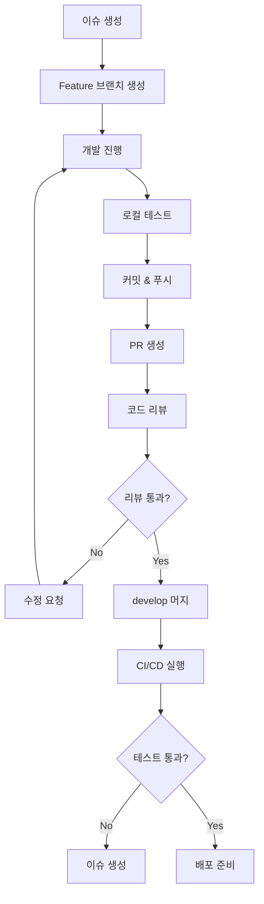

# 암호화폐 자동매매 시스템 - 깃허브 관리 전략
## GitHub Management Strategy & Workflow

---

## 📋 문서 정보

| 항목 | 내용 |
|------|------|
| **문서명** | 깃허브 관리 전략 및 워크플로우 |
| **버전** | v1.0 |
| **작성일** | 2025년 8월 31일 |
| **대상** | 개발팀, Claude 서브 에이전트 |
| **목적** | 체계적인 코드 관리 및 협업 |

---

## 🏗️ 1. 저장소 구조

### 1.1 메인 저장소
```
crypto-autotrade-system/
├── README.md                    # 프로젝트 개요
├── LICENSE                      # 라이선스
├── .gitignore                   # Git 제외 파일
├── requirements.txt             # Python 패키지 의존성
├── setup.py                     # 패키지 설정
├── pyproject.toml              # 프로젝트 설정
├── .github/                    # GitHub Actions 워크플로우
│   ├── workflows/
│   │   ├── ci.yml              # 지속적 통합
│   │   ├── cd.yml              # 지속적 배포
│   │   └── code-quality.yml    # 코드 품질 검사
│   └── ISSUE_TEMPLATE/         # 이슈 템플릿
├── docs/                       # 문서
│   ├── PRD.md                  # 제품 요구사항
│   ├── TRD.md                  # 기술 요구사항
│   ├── API.md                  # API 문서
│   └── DEPLOYMENT.md           # 배포 가이드
├── core/                       # 공통 코어 모듈
│   ├── __init__.py
│   ├── trading_engine.py       # 거래 엔진
│   ├── risk_manager.py         # 리스크 관리
│   ├── api_connector.py        # API 연동
│   ├── config_manager.py       # 설정 관리
│   ├── time_controller.py      # 시간 제어
│   ├── security_module.py      # 보안 모듈
│   ├── data_processor.py       # 데이터 처리
│   ├── notification.py         # 알림 시스템
│   └── logger.py              # 로깅 시스템
├── desktop/                    # EXE 버전
│   ├── __init__.py
│   ├── main_gui.py            # 메인 윈도우
│   ├── tabs/                  # 탭 모듈
│   │   ├── __init__.py
│   │   ├── entry_tab.py       # 진입 설정 탭
│   │   ├── exit_tab.py        # 청산 설정 탭
│   │   └── settings_tab.py    # 사용자 설정 탭
│   ├── widgets/               # 위젯 모듈
│   │   ├── __init__.py
│   │   ├── chart_widget.py    # 차트 위젯
│   │   ├── position_widget.py # 포지션 위젯
│   │   └── status_widget.py   # 상태 위젯
│   └── utils/                 # 유틸리티
│       ├── __init__.py
│       ├── gui_utils.py       # GUI 유틸리티
│       └── theme_manager.py   # 테마 관리
├── web/                       # 웹 대시보드 버전
│   ├── __init__.py
│   ├── app.py                 # Flask 메인 앱
│   ├── routes/                # 라우트 모듈
│   │   ├── __init__.py
│   │   ├── api.py             # REST API
│   │   ├── websocket.py       # WebSocket
│   │   └── auth.py            # 인증
│   ├── templates/             # HTML 템플릿
│   │   ├── base.html          # 기본 템플릿
│   │   ├── dashboard.html     # 대시보드
│   │   ├── settings.html      # 설정 페이지
│   │   └── login.html         # 로그인 페이지
│   ├── static/                # 정적 파일
│   │   ├── css/
│   │   │   ├── main.css       # 메인 스타일
│   │   │   └── mobile.css     # 모바일 스타일
│   │   ├── js/
│   │   │   ├── main.js        # 메인 JavaScript
│   │   │   ├── websocket.js   # WebSocket 클라이언트
│   │   │   └── chart.js       # 차트 관리
│   │   └── img/               # 이미지
│   └── utils/                 # 웹 유틸리티
│       ├── __init__.py
│       ├── web_utils.py       # 웹 유틸리티
│       └── session_manager.py # 세션 관리
├── tests/                     # 테스트
│   ├── __init__.py
│   ├── test_core/             # 코어 모듈 테스트
│   ├── test_desktop/          # 데스크톱 테스트
│   ├── test_web/              # 웹 테스트
│   └── fixtures/              # 테스트 데이터
├── scripts/                   # 스크립트
│   ├── build_exe.py           # EXE 빌드 스크립트
│   ├── deploy_web.py          # 웹 배포 스크립트
│   └── setup_dev.py           # 개발 환경 설정
└── config/                    # 설정 파일
    ├── development.yaml       # 개발 환경
    ├── production.yaml        # 운영 환경
    └── test.yaml              # 테스트 환경
```

### 1.2 브랜치 전략 (Git Flow)

```
main (운영)
├── develop (개발 통합)
│   ├── feature/core-trading-engine      # 거래 엔진 개발
│   ├── feature/desktop-gui             # 데스크톱 GUI 개발
│   ├── feature/web-dashboard           # 웹 대시보드 개발
│   ├── feature/security-module         # 보안 모듈 개발
│   └── feature/api-integration         # API 통합 개발
├── release/v1.0.0                      # 릴리즈 준비
└── hotfix/critical-bug-fix             # 긴급 수정
```

**브랜치 규칙:**
- `main`: 운영 환경 배포용 (항상 안정)
- `develop`: 개발 통합 브랜치
- `feature/*`: 기능 개발 브랜치
- `release/*`: 릴리즈 준비 브랜치
- `hotfix/*`: 긴급 수정 브랜치

---

## 👥 2. 권한 체계

### 2.1 팀 구성 및 권한

**🔴 Owner (프로젝트 소유자)**
- 저장소 생성/삭제
- 팀원 초대/제거
- 브랜치 보호 규칙 설정
- 릴리즈 승인

**🟠 Admin (관리자)**
- 모든 브랜치 접근
- PR 승인 및 머지
- 설정 변경
- 배포 권한

**🟡 Developer (개발자)**
- feature 브랜치 생성/수정
- PR 생성
- 코드 리뷰 참여
- develop 브랜치 읽기

**🟢 Reviewer (리뷰어)**
- 코드 리뷰
- 이슈 생성/댓글
- PR 댓글
- 읽기 전용 접근

### 2.2 브랜치 보호 규칙

**main 브랜치:**
```yaml
protection_rules:
  required_reviews: 2
  dismiss_stale_reviews: true
  require_code_owner_reviews: true
  required_status_checks:
    - ci/tests
    - ci/code-quality
    - ci/security-scan
  enforce_admins: true
  allow_force_pushes: false
  allow_deletions: false
```

**develop 브랜치:**
```yaml
protection_rules:
  required_reviews: 1
  required_status_checks:
    - ci/tests
    - ci/code-quality
  allow_force_pushes: false
  allow_deletions: false
```

---

## 🔄 3. 워크플로우

### 3.1 개발 워크플로우



### 3.2 커밋 메시지 규칙

**Conventional Commits 사용:**
```
<type>[optional scope]: <description>

[optional body]

[optional footer(s)]
```

**타입 정의:**
- `feat`: 새로운 기능 추가
- `fix`: 버그 수정
- `docs`: 문서 변경
- `style`: 코드 스타일 변경
- `refactor`: 코드 리팩토링
- `test`: 테스트 추가/수정
- `chore`: 빌드 프로세스 또는 도구 변경

**예시:**
```
feat(core): add trading engine with 5 entry conditions

- Implement moving average condition
- Add Price Channel breakout detection
- Support tick-based entry logic
- Add candle state condition
- Integrate order book monitoring

Closes #123
```

### 3.3 PR (Pull Request) 템플릿

```markdown
## 📋 변경 사항
<!-- 이 PR에서 변경된 내용을 설명해주세요 -->

## 🎯 관련 이슈
<!-- 관련된 이슈 번호를 적어주세요 -->
Closes #

## ✅ 체크리스트
- [ ] 코드가 프로젝트 스타일 가이드를 따름
- [ ] 자체 리뷰를 완료함
- [ ] 코드에 주석을 추가함 (필요한 경우)
- [ ] 문서를 업데이트함 (필요한 경우)
- [ ] 변경 사항에 대한 테스트를 추가함
- [ ] 모든 테스트가 통과함
- [ ] 의존성 변경 사항을 확인함

## 🧪 테스트 방법
<!-- 이 변경 사항을 테스트하는 방법을 설명해주세요 -->

## 📸 스크린샷 (UI 변경 시)
<!-- UI 변경이 있는 경우 스크린샷을 첨부해주세요 -->

## 📝 추가 정보
<!-- 리뷰어가 알아야 할 추가 정보가 있다면 적어주세요 -->
```

---

## 🤖 4. GitHub Actions CI/CD

### 4.1 지속적 통합 (.github/workflows/ci.yml)

```yaml
name: Continuous Integration

on:
  push:
    branches: [ develop, main ]
  pull_request:
    branches: [ develop, main ]

jobs:
  test:
    runs-on: ubuntu-latest
    strategy:
      matrix:
        python-version: [3.8, 3.9, 3.10]
    
    steps:
    - uses: actions/checkout@v3
    
    - name: Set up Python ${{ matrix.python-version }}
      uses: actions/setup-python@v3
      with:
        python-version: ${{ matrix.python-version }}
    
    - name: Install dependencies
      run: |
        python -m pip install --upgrade pip
        pip install -r requirements.txt
        pip install -r requirements-dev.txt
    
    - name: Lint with flake8
      run: |
        flake8 . --count --select=E9,F63,F7,F82 --show-source --statistics
        flake8 . --count --exit-zero --max-complexity=10 --max-line-length=127 --statistics
    
    - name: Type check with mypy
      run: mypy core/ desktop/ web/
    
    - name: Test with pytest
      run: |
        pytest tests/ --cov=core --cov=desktop --cov=web --cov-report=xml
    
    - name: Upload coverage to Codecov
      uses: codecov/codecov-action@v3
      with:
        file: ./coverage.xml

  security:
    runs-on: ubuntu-latest
    steps:
    - uses: actions/checkout@v3
    
    - name: Run security scan
      uses: securecodewarrior/github-action-add-sarif@v1
      with:
        sarif-file: 'security-scan-results.sarif'
```

### 4.2 코드 품질 검사 (.github/workflows/code-quality.yml)

```yaml
name: Code Quality

on:
  push:
    branches: [ develop, main ]
  pull_request:
    branches: [ develop, main ]

jobs:
  quality:
    runs-on: ubuntu-latest
    
    steps:
    - uses: actions/checkout@v3
    
    - name: Set up Python
      uses: actions/setup-python@v3
      with:
        python-version: 3.9
    
    - name: Install dependencies
      run: |
        python -m pip install --upgrade pip
        pip install black isort flake8 mypy bandit
    
    - name: Format check with black
      run: black --check .
    
    - name: Import sort check with isort
      run: isort --check-only .
    
    - name: Lint with flake8
      run: flake8 .
    
    - name: Type check with mypy
      run: mypy .
    
    - name: Security check with bandit
      run: bandit -r . -f json -o bandit-report.json
    
    - name: Upload bandit report
      uses: actions/upload-artifact@v3
      with:
        name: bandit-report
        path: bandit-report.json
```

### 4.3 배포 워크플로우 (.github/workflows/cd.yml)

```yaml
name: Continuous Deployment

on:
  push:
    tags:
      - 'v*'

jobs:
  build-exe:
    runs-on: windows-latest
    steps:
    - uses: actions/checkout@v3
    
    - name: Set up Python
      uses: actions/setup-python@v3
      with:
        python-version: 3.9
    
    - name: Install dependencies
      run: |
        python -m pip install --upgrade pip
        pip install -r requirements.txt
        pip install pyinstaller
    
    - name: Build EXE
      run: python scripts/build_exe.py
    
    - name: Upload EXE artifact
      uses: actions/upload-artifact@v3
      with:
        name: crypto-autotrade-exe
        path: dist/

  deploy-web:
    runs-on: ubuntu-latest
    needs: build-exe
    steps:
    - uses: actions/checkout@v3
    
    - name: Deploy to server
      run: python scripts/deploy_web.py
      env:
        DEPLOY_KEY: ${{ secrets.DEPLOY_KEY }}
        SERVER_HOST: ${{ secrets.SERVER_HOST }}
```

---

## 📊 5. 이슈 관리

### 5.1 이슈 템플릿

**버그 리포트 (.github/ISSUE_TEMPLATE/bug_report.md):**
```markdown
---
name: 버그 리포트
about: 버그를 신고해주세요
title: '[BUG] '
labels: bug
assignees: ''
---

## 🐛 버그 설명
버그에 대한 명확하고 간결한 설명

## 🔄 재현 방법
1. '...'로 이동
2. '....'를 클릭
3. '....'까지 스크롤
4. 오류 확인

## ✅ 예상 동작
예상했던 동작에 대한 설명

## ❌ 실제 동작
실제로 발생한 동작에 대한 설명

## 📸 스크린샷
가능하다면 스크린샷을 첨부해주세요

## 🖥️ 환경
- OS: [예: Windows 10]
- 브라우저: [예: Chrome 91]
- 버전: [예: v1.0.0]

## 📝 추가 정보
버그에 대한 추가 정보나 컨텍스트
```

**기능 요청 (.github/ISSUE_TEMPLATE/feature_request.md):**
```markdown
---
name: 기능 요청
about: 새로운 기능을 제안해주세요
title: '[FEATURE] '
labels: enhancement
assignees: ''
---

## 🎯 기능 설명
원하는 기능에 대한 명확하고 간결한 설명

## 💡 동기
이 기능이 필요한 이유나 해결하고자 하는 문제

## 📋 상세 요구사항
- [ ] 요구사항 1
- [ ] 요구사항 2
- [ ] 요구사항 3

## 🎨 UI/UX 제안
UI나 사용자 경험에 대한 제안 (선택사항)

## 📝 추가 정보
기능에 대한 추가 정보나 컨텍스트
```

### 5.2 라벨 시스템

**우선순위:**
- 🔴 `priority/critical`: 치명적 (즉시 수정 필요)
- 🟠 `priority/high`: 높음 (다음 릴리즈)
- 🟡 `priority/medium`: 보통 (계획된 릴리즈)
- 🟢 `priority/low`: 낮음 (시간 여유시)

**타입:**
- 🐛 `bug`: 버그
- ✨ `enhancement`: 개선사항
- 📚 `documentation`: 문서
- 🔧 `maintenance`: 유지보수
- ❓ `question`: 질문

**모듈:**
- 🎯 `module/core`: 코어 모듈
- 🖥️ `module/desktop`: 데스크톱 버전
- 🌐 `module/web`: 웹 대시보드
- 🔐 `module/security`: 보안 모듈
- 📊 `module/api`: API 연동

---

## 📈 6. 코드 리뷰 가이드라인

### 6.1 리뷰 체크리스트

**기능성:**
- [ ] 코드가 요구사항을 충족하는가?
- [ ] 엣지 케이스가 처리되었는가?
- [ ] 오류 처리가 적절한가?

**성능:**
- [ ] 성능에 영향을 주는 부분이 있는가?
- [ ] 메모리 누수 가능성은 없는가?
- [ ] 불필요한 연산이 있는가?

**보안:**
- [ ] 보안 취약점이 있는가?
- [ ] 입력 검증이 적절한가?
- [ ] 민감한 정보가 노출되지 않는가?

**가독성:**
- [ ] 코드가 이해하기 쉬운가?
- [ ] 변수명과 함수명이 명확한가?
- [ ] 주석이 적절한가?

**테스트:**
- [ ] 테스트 커버리지가 충분한가?
- [ ] 테스트가 의미있는가?
- [ ] 모든 테스트가 통과하는가?

### 6.2 리뷰 코멘트 가이드

**좋은 코멘트:**
```
# 구체적이고 건설적
"이 함수는 너무 길어서 가독성이 떨어집니다. 
`_validate_entry_conditions`와 `_execute_entry`로 분리하는 것이 어떨까요?"

# 대안 제시
"여기서 for 루프 대신 list comprehension을 사용하면 더 파이썬다울 것 같습니다:
`valid_signals = [s for s in signals if s.is_valid()]`"

# 칭찬과 함께
"이 에러 핸들링 로직이 정말 잘 작성되었네요! 
다만 로그 레벨을 ERROR에서 WARNING으로 낮추는 것이 어떨까요?"
```

**피해야 할 코멘트:**
```
# 너무 모호함
"이 코드가 이상해요."

# 비판적
"이렇게 하면 안 됩니다."

# 해결책 없음
"성능이 안 좋을 것 같아요."
```

---

## 🔧 7. 개발 환경 설정

### 7.1 로컬 개발 환경

**필수 도구:**
```bash
# Python 환경
python -m venv venv
source venv/bin/activate  # Windows: venv\Scripts\activate
pip install -r requirements.txt
pip install -r requirements-dev.txt

# Git 설정
git config --global user.name "Your Name"
git config --global user.email "your.email@example.com"
git config --global init.defaultBranch main

# Pre-commit 훅 설치
pre-commit install
```

**개발 도구 설정:**
```bash
# 코드 포맷팅
black .
isort .

# 린팅
flake8 .
mypy .

# 보안 검사
bandit -r .

# 테스트
pytest tests/ --cov
```

### 7.2 IDE 설정 (VS Code)

**.vscode/settings.json:**
```json
{
    "python.defaultInterpreterPath": "./venv/bin/python",
    "python.linting.enabled": true,
    "python.linting.flake8Enabled": true,
    "python.linting.mypyEnabled": true,
    "python.formatting.provider": "black",
    "python.sortImports.args": ["--profile", "black"],
    "editor.formatOnSave": true,
    "editor.codeActionsOnSave": {
        "source.organizeImports": true
    },
    "files.exclude": {
        "**/__pycache__": true,
        "**/*.pyc": true,
        ".pytest_cache": true,
        ".coverage": true,
        "htmlcov": true
    }
}
```

**.vscode/extensions.json:**
```json
{
    "recommendations": [
        "ms-python.python",
        "ms-python.flake8",
        "ms-python.mypy-type-checker",
        "ms-python.black-formatter",
        "ms-python.isort",
        "ms-vscode.vscode-json",
        "redhat.vscode-yaml",
        "ms-vscode.vscode-typescript-next"
    ]
}
```

---

## 📚 8. 문서화 전략

### 8.1 문서 구조
```
docs/
├── README.md                   # 프로젝트 개요
├── CONTRIBUTING.md             # 기여 가이드
├── CODE_OF_CONDUCT.md          # 행동 강령
├── CHANGELOG.md                # 변경 로그
├── api/                        # API 문서
│   ├── core.md                 # 코어 API
│   ├── desktop.md              # 데스크톱 API
│   └── web.md                  # 웹 API
├── guides/                     # 가이드
│   ├── installation.md         # 설치 가이드
│   ├── configuration.md        # 설정 가이드
│   └── troubleshooting.md      # 문제 해결
└── architecture/               # 아키텍처
    ├── overview.md             # 전체 개요
    ├── core-modules.md         # 코어 모듈
    └── security.md             # 보안 설계
```

### 8.2 자동 문서 생성

**Sphinx 설정 (docs/conf.py):**
```python
import os
import sys
sys.path.insert(0, os.path.abspath('..'))

project = 'Crypto AutoTrade System'
copyright = '2025, Development Team'
author = 'Development Team'

extensions = [
    'sphinx.ext.autodoc',
    'sphinx.ext.viewcode',
    'sphinx.ext.napoleon',
    'sphinx_rtd_theme',
]

html_theme = 'sphinx_rtd_theme'
```

**자동 문서 빌드:**
```bash
# API 문서 생성
sphinx-apidoc -o docs/api core/ desktop/ web/

# HTML 문서 빌드
sphinx-build -b html docs/ docs/_build/html
```

---

## 🚀 9. 배포 전략

### 9.1 환경별 배포

**개발 환경:**
- 자동 배포: develop 브랜치 푸시 시
- 테스트 서버: dev.crypto-autotrade.com
- 데이터베이스: 개발용 DB

**스테이징 환경:**
- 수동 배포: release 브랜치 생성 시
- 스테이징 서버: staging.crypto-autotrade.com
- 데이터베이스: 운영 DB 복사본

**운영 환경:**
- 수동 배포: main 브랜치 태그 시
- 운영 서버: crypto-autotrade.com
- 데이터베이스: 운영 DB

### 9.2 배포 체크리스트

**배포 전:**
- [ ] 모든 테스트 통과
- [ ] 코드 리뷰 완료
- [ ] 보안 스캔 통과
- [ ] 성능 테스트 완료
- [ ] 문서 업데이트

**배포 중:**
- [ ] 데이터베이스 백업
- [ ] 서비스 중단 공지
- [ ] 점진적 배포 (Blue-Green)
- [ ] 헬스 체크 확인

**배포 후:**
- [ ] 기능 테스트
- [ ] 성능 모니터링
- [ ] 오류 로그 확인
- [ ] 사용자 피드백 수집

---

## 📊 10. 모니터링 및 분석

### 10.1 코드 품질 메트릭

**SonarQube 설정:**
```yaml
# sonar-project.properties
sonar.projectKey=crypto-autotrade-system
sonar.sources=core,desktop,web
sonar.tests=tests
sonar.python.coverage.reportPaths=coverage.xml
sonar.python.xunit.reportPath=pytest-report.xml
```

**품질 게이트:**
- 코드 커버리지: 80% 이상
- 중복 코드: 3% 이하
- 기술 부채: A 등급
- 보안 취약점: 0개

### 10.2 성능 모니터링

**GitHub Insights 활용:**
- 커밋 빈도 추적
- PR 리뷰 시간 측정
- 이슈 해결 시간 분석
- 코드 변경량 모니터링

**자동화된 리포트:**
```python
# scripts/generate_report.py
def generate_weekly_report():
    """주간 개발 리포트 생성"""
    commits = get_commits_this_week()
    prs = get_merged_prs()
    issues = get_closed_issues()
    
    report = {
        'commits': len(commits),
        'prs_merged': len(prs),
        'issues_closed': len(issues),
        'code_coverage': get_coverage_percentage(),
        'quality_score': get_sonar_score()
    }
    
    send_report_email(report)
```

---

## 🔒 11. 보안 관리

### 11.1 시크릿 관리

**GitHub Secrets:**
```
DEPLOY_KEY          # 배포 키
SERVER_HOST         # 서버 호스트
DATABASE_URL        # 데이터베이스 URL
API_ENCRYPTION_KEY  # API 암호화 키
NOTIFICATION_TOKEN  # 알림 토큰
```

**환경별 시크릿:**
```bash
# 개발 환경
DEV_DATABASE_URL
DEV_API_KEY

# 스테이징 환경
STAGING_DATABASE_URL
STAGING_API_KEY

# 운영 환경
PROD_DATABASE_URL
PROD_API_KEY
```

### 11.2 보안 스캔

**자동 보안 검사:**
```yaml
# .github/workflows/security.yml
name: Security Scan

on:
  push:
    branches: [ main, develop ]
  schedule:
    - cron: '0 2 * * 1'  # 매주 월요일 2시

jobs:
  security:
    runs-on: ubuntu-latest
    steps:
    - uses: actions/checkout@v3
    
    - name: Run Snyk to check for vulnerabilities
      uses: snyk/actions/python@master
      env:
        SNYK_TOKEN: ${{ secrets.SNYK_TOKEN }}
    
    - name: Run CodeQL Analysis
      uses: github/codeql-action/analyze@v2
      with:
        languages: python, javascript
```

---

## 📋 12. 결론

이 깃허브 관리 전략은 **체계적이고 전문적인 개발 환경**을 구축하기 위한 완전한 가이드입니다.

### 12.1 핵심 원칙
- ✅ **체계적 브랜치 관리**: Git Flow로 안정적인 개발
- ✅ **엄격한 코드 리뷰**: 품질 보장
- ✅ **자동화된 CI/CD**: 효율적인 배포
- ✅ **포괄적 문서화**: 지식 공유
- ✅ **지속적 모니터링**: 품질 개선

### 12.2 기대 효과
- 🎯 **개발 효율성 향상**: 명확한 프로세스
- 🎯 **코드 품질 보장**: 자동화된 검증
- 🎯 **팀 협업 강화**: 표준화된 워크플로우
- 🎯 **안정적 배포**: 검증된 배포 프로세스
- 🎯 **지속적 개선**: 데이터 기반 의사결정

이 가이드를 따라 구현하면 **엔터프라이즈급 개발 환경**을 구축할 수 있습니다.

---

**문서 끝**

